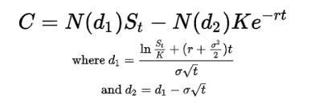

# Math
Models for pricing, insurance premiums, historical gas data, etc.

## Gas Price Model

We start by plotting the raw historical gas prices, as well as the sliding window maximum gas price over a fixed window (in this case 1 day).
 - 1 day").

Next, we use the sliding window maximum gas price to generate a discrete histogram, allowing us to visualise the probability distribution in gas price space. After that, we fit parameters to our probability distribution to find a function that approximates the distribution. This serves as our future projection
").

### Pricing

We price the derivative by assuming a linear payoff function with a well-defined low and high gas price and a constant payoff above the high gas price. Since we have the probability distribution, this is simply a matter of taking the expected value of the payoff function over the fitted (expected future) probability distribution, i.e. integrating the payoff function over the pdf which gives the expected payoff as

$$ \mathbb{E}[S] = \int_{0}^{\infty} s \ dF(s) $$

### Improvements

In the future, we can build a more sophisticated model that also takes into account other data not just historical gas data. For example, if we know there will be an upgrade to the network in 2 weeks or a big NFT sale, we can use this information to inform our model that the probability distribution will be skewed as a result.

Ideally we would use black-scholes to price the options but this may be expensive to run on-chain, although we can always run this in a ZK circuit as well and simply submit the proof that we calculated everything correctly.

.
